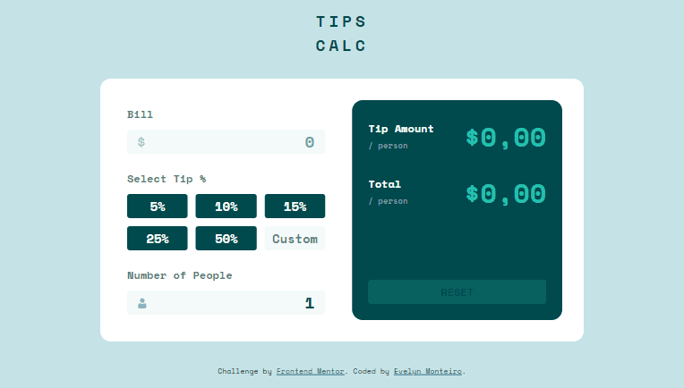
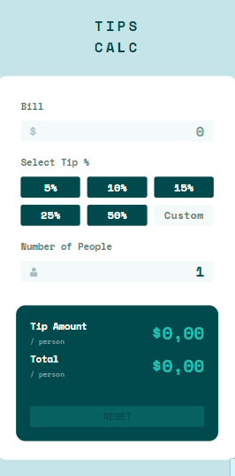

# 💸 TipsCalc

## Frontend Mentor - Tip calculator app solution

This is a solution to the [Tip calculator app challenge on Frontend Mentor](https://www.frontendmentor.io/challenges/tip-calculator-app-ugJNGbJUX). Frontend Mentor challenges help you improve your coding skills by building realistic projects.

<br>

## Table of contents

- [Overview](#overview)
  - [The challenge](#the-challenge)
  - [Screenshots](#screenshots)
  - [Link](#link)
- [My process](#my-process)
  - [Built with](#built-with)
  - [What I learned](#what-i-learned)
  - [Continued development](#continued-development)
- [Author](#author)

<br>

## Overview

### The challenge

Users should be able to:

- View the optimal layout for the app depending on their device's screen size
- See hover states for all interactive elements on the page
- Calculate the correct tip and total cost of the bill per person

### Screenshots

<br>

<p>
  
</p>

<p>
    
    
</p>

### Link

- Live Site URL: [Click here!](https://tipscalcevemon.netlify.app/)

<br>

## My process

### Built with

- Semantic HTML5 markup
- CSS custom properties
- Flexbox
- CSS Grid
- Vanilla Javascript

### What I learned

I was really excited to find out how to make the results appear more natural and automatic with the input keyup event. This brought a very fluid effect to the app.

```js
numberPeople.addEventListener("keyup", function () {
  if (validateFields()) {
    calculate();
  }
  hasBeenReset = false;
  enableReset();
});
```

### Continued development

With this project I discovered some important subjects that I will continue to study to use in future projects, which are Regular Expressions and also Prototypes in javascript.

<br>

## Author

- Linkedin Link - [Click here!](https://www.linkedin.com/in/evelyn-monteiro-5b61981b3/)
- Twitter Link - [Click here!](https://twitter.com/Evelyn39310366)
- Frontend Mentor - [Click here!](https://www.frontendmentor.io/profile/evelynmonteiro)
